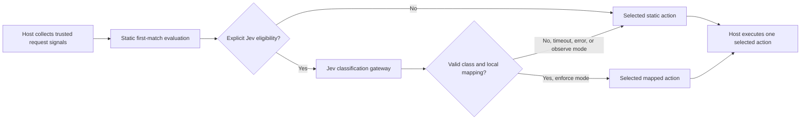

# Architecture and host integration

This package selects actions; the host application owns the request lifecycle. The static evaluator is deterministic and has no network or storage dependencies. The optional Jev path makes a bounded model request only when the host calls `decideWithJev` with an eligible policy and a gateway.

## Decision stages

1. The host collects the request method, path, network and device observations it trusts. It may call `analyzeFingerprint`, `analyzeProbePath`, or `advanceBehavior` to derive versioned evidence. These helpers do not fetch an IP database or verify a visitor's identity.
2. `parsePublishedConfig` validates a published snapshot. `evaluateRules` selects the first matching enabled rule, or the schema-specific default. `explainRules` adds a condition trace for simulation without including raw signal values.
3. For an optional Jev decision, the host supplies a separate policy and calls `decideWithJev`. That function runs the same static evaluator first. Only explicitly selected GET redirects without known probe or path-enumeration evidence can reach the gateway. Valid classes can select an action only through a local mapping. All other cases return the static action. See [Jev decision gateway](jev-gateway.md).
4. The host executes **only** `result.decision.action` (or the action from `evaluateRules`) and records the actual outcome separately. The engine does not issue HTTP redirects, proxy origin requests, persist events, or issue attribution IDs.

`decideWithJev` returns `staticDecision`, the selected `decision`, and a small Jev status record. In `observe` mode, `candidateDecision` is available for review while `decision` remains static. A classification label is evidence, not a verified visitor identity or proof of intent.

## Host responsibilities

| Concern | Host responsibility |
| --- | --- |
| Inputs | Validate the client IP from a trusted ingress, choose which headers and behavioral observations to use, and avoid passing credentials or customer data as signals. |
| State | Scope behavior state by property and visitor key; control its lifetime and storage. `advanceBehavior` only transforms a state supplied by the host. |
| Jev access | Supply the API key, rate and spend limits, circuit breaker, sampling policy, telemetry retention, and a reviewed local action mapping. |
| Action execution | Apply redirects, blocks, allows or origin routing once; handle path/query forwarding, error responses and attribution outside this package. |
| Release | Pin a reviewed engine commit, test with the host's real signal extraction, and deploy the host separately. A public package update does not change a running service. |

The engine deliberately separates **observed evidence**, **selected action**, and **executed outcome**. For example, `request.probe: true` is an observation; it blocks only if a published rule selects a block action, and the host must still execute that action successfully.

For policy fields, ordering, and action constraints, see the [policy reference](policy-reference.md). For the deliberately narrow probe catalog and its provenance, see [probe rule provenance](rule-provenance.md).
