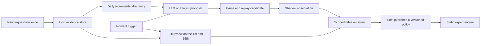

# Rule learning and review

The engine provides deterministic contracts for evaluating proposed rules. It does not schedule jobs, call a rule-generating LLM, store traffic, label visitors, or publish policies. A host may use any model or analyst workflow to produce a proposal, but the proposal remains outside the live policy until a separate release process publishes a new version.



## Cadence

- **Daily incremental learning:** inspect newly arrived evidence, optionally with a longer lookback for sparse traffic. A run may produce no proposal. Daily execution is not a publication deadline.
- **Full review on the 1st and 15th:** review candidate, shadow and active rules for expired evidence, false positives, exact duplicates, unreachable rules, conflicts and changed traffic patterns. The host owns scheduling and the case corpus; `reviewRuleSet` performs only the deterministic checks described below.
- **Incident trigger:** run the same validation and release gates immediately for urgent evidence. An incident does not grant a model direct write access to the published policy.

All calendar dates are host choices. Use an explicit UTC timestamp with each library call; the host can interpret the 1st and 15th in its chosen operating timezone. A release is gated by evidence, not by the calendar.

## Proposal contract

`parseRuleProposal(config, value)` accepts a declarative rule bound to one parsed published policy's property and version. It reuses `parsePublishedConfig` to validate the proposed rule's conditions, action and destination. It rejects duplicate rule IDs, unsupported top-level fields, invalid provenance identifiers and out-of-order review/expiry timestamps. Model- and feed-sourced proposals require an expiry. A candidate cannot run before an existing enabled allow or block rule; equal priority is safe because the candidate is appended after existing rules. It does not add the rule to the live policy.

```ts
import {
  parsePublishedConfig,
  parseRuleProposal,
  replayRuleProposal,
  reviewRuleProposal,
} from "@radixing/traffic-engine";

const config = parsePublishedConfig({
  schemaVersion: 2,
  propertyId: "example",
  version: 4,
  domains: ["go.example.com"],
  defaultAction: { type: "redirect", status: 302, url: "https://app.example.com/" },
  rules: [],
});

const proposal = parseRuleProposal(config, {
  schemaVersion: 1,
  id: "proposal-42",
  propertyId: "example",
  baseConfigVersion: 4,
  source: { kind: "llm", referenceId: "batch-42" },
  evidenceIds: ["reviewed-event-1"],
  createdAt: "2026-09-26T08:00:00.000Z",
  reviewAt: "2026-10-01T00:00:00.000Z",
  expiresAt: "2026-10-15T00:00:00.000Z",
  rule: {
    id: "sensitive-probe",
    name: "Sensitive probe evidence",
    enabled: true,
    priority: 10,
    match: "all",
    conditions: [{ field: "request.probe", operator: "eq", value: true }],
    action: { type: "block", status: 404 },
  },
});

const replay = replayRuleProposal(config, proposal, [
  { signals: { "request.probe": true }, reviewedLabel: "unwanted" },
  { signals: { "request.probe": false }, reviewedLabel: "legitimate" },
]);
const lifecycle = reviewRuleProposal(proposal, "2026-10-01T00:00:00.000Z");
```

The source reference and evidence IDs must be opaque identifiers, not raw IP addresses, URLs, credentials or customer data. Keep exact IP and other private enrichment in the host's access-controlled store. If an IP-derived rule is proposed, give it a bounded scope and expiry. The engine does not perform an IP reputation lookup or determine whether an IP belongs to a human.

## Replay and promotion

`replayRuleProposal` appends the candidate to a temporary copy of the policy and evaluates every supplied case with the existing first-match ordering. Its aggregate result includes candidate matches, actual selections, changed actions, reviewed cases and newly blocked reviewed-legitimate cases. It returns no case signals or IP values. A match can be shadowed by an earlier rule, so `matched` and `selected` are intentionally separate.

`reviewedLabel` means an independently reviewed case. Jev or another model's class is a useful discovery hint, but is not a reviewed label and must not be copied into this field without independent verification. The summary is evidence for a release review, not a calibrated accuracy score. Hosts should also inspect representative counterexamples and behavior after a shadow or scoped canary before publishing any traffic-changing rule. When the base policy changes, regenerate or revalidate the proposal against the new version.

The host owns the transition from candidate to shadow to active to retired. It must reject expired proposals before publication, carry the proposal's review and expiry dates into the active rule's review record, publish a new immutable policy version, retain a rollback target, and monitor actual execution separately from the selected action. The engine performs none of those side effects.

## Full rule-set review

`reviewRuleSet(config, records, asOf)` returns review issues for enabled rules. The host supplies one `RuleReviewRecord` per rule with `reviewAt` and optional `expiresAt`. Missing records, due reviews and expired rules are flagged. The function also finds **exactly equivalent condition sets** in first-match order: a later rule with the same action is marked `duplicate`; one with a different action is marked `shadowed`. It does not claim to detect every semantic overlap and never deletes or disables a rule. A rare but still valid signature may remain active after review.

For stronger review, the host should compare historical match counts, verified false positives, changed traffic mix, source reliability and the current value of each rule. These measurements and all manual or automated promotion decisions remain outside the package.
